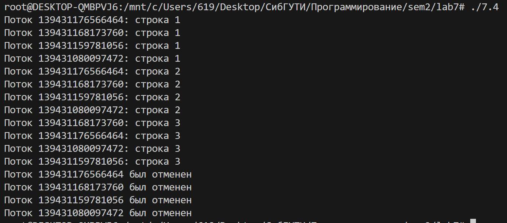

1.	Создать поток
```c
#include <pthread.h>
#include <stdio.h>

void* thread_func(void* arg) {
    for (int i = 0; i < 5; i++) {
        printf("Дочерний поток: строка %d\n", i + 1);
    }
    return NULL;
}

int main() {
    pthread_t thread;
    pthread_create(&thread, NULL, thread_func, NULL);

    for (int i = 0; i < 5; i++) {
        printf("Родительский поток: строка %d\n", i + 1);
    }

    pthread_join(thread, NULL);
    return 0;
}

```

2. Ожидание потока
```c
#include <pthread.h>
#include <stdio.h>

void* thread_func(void* arg) {
    for (int i = 0; i < 5; i++) {
        printf("Дочерний поток: строка %d\n", i + 1);
    }
    return NULL;
}

int main() {
    pthread_t thread;
    pthread_create(&thread, NULL, thread_func, NULL);

    pthread_join(thread, NULL);

    for (int i = 0; i < 5; i++) {
        printf("Родительский поток: строка %d\n", i + 1);
    }

    return 0;
}
```


3. Параметры потока
```c
#include <pthread.h>
#include <stdio.h>

void* thread_func(void* arg) {
    char** messages = (char**)arg;
    for (int i = 0; messages[i] != NULL; i++) {
        printf("%s\n", messages[i]);
    }
    return NULL;
}

int main() {
    pthread_t threads[4];
    char* msgs[4][4] = {
        {"Поток 1 - строка 1", "Поток 1 - строка 2", "Поток 1 - строка 3", NULL},
        {"Поток 2 - строка 1", "Поток 2 - строка 2", "Поток 2 - строка 3", NULL},
        {"Поток 3 - строка 1", "Поток 3 - строка 2", "Поток 3 - строка 3", NULL},
        {"Поток 4 - строка 1", "Поток 4 - строка 2", "Поток 4 - строка 3", NULL},
    };

    for (int i = 0; i < 4; i++) {
        pthread_create(&threads[i], NULL, thread_func, msgs[i]);
    }

    for (int i = 0; i < 4; i++) {
        pthread_join(threads[i], NULL);
    }

    return 0;
}

```


4.	Завершение нити без ожидания

```c
#include <pthread.h>
#include <stdio.h>
#include <unistd.h>

void* thread_func(void* arg) {
    for (int i = 0; i < 5; i++) {
        printf("Поток %ld: строка %d\n", pthread_self(), i + 1);
        sleep(1);
    }
    return NULL;
}

int main() {
    pthread_t threads[4];

    for (int i = 0; i < 4; i++) {
        pthread_create(&threads[i], NULL, thread_func, NULL);
    }

    sleep(2);

    for (int i = 0; i < 4; i++) {
        pthread_cancel(threads[i]);
        printf("Поток %ld был отменен\n", threads[i]);
    }

    for (int i = 0; i < 4; i++) {
        pthread_join(threads[i], NULL);
    }

    return 0;
}

```


5.	Обработать завершение потока

```c
#include <pthread.h>
#include <stdio.h>
#include <unistd.h>

void cleanup_handler(void* arg) {
    printf("Поток %ld завершается. Выполняется cleanup.\n", pthread_self());
}

void* thread_func(void* arg) {
    pthread_cleanup_push(cleanup_handler, NULL);

    for (int i = 0; i < 5; i++) {
        printf("Поток %ld: строка %d\n", pthread_self(), i + 1);
        sleep(1);
        pthread_testcancel();
    }

    pthread_cleanup_pop(1);
    return NULL;
}

int main() {
    pthread_t threads[4];

    for (int i = 0; i < 4; i++) {
        pthread_create(&threads[i], NULL, thread_func, NULL);
    }

    sleep(2);

    for (int i = 0; i < 4; i++) {
        pthread_cancel(threads[i]);
        printf("Поток %ld был отменен\n", threads[i]);
    }

    for (int i = 0; i < 4; i++) {
        pthread_join(threads[i], NULL);
    }

    return 0;
}

```


6.	Реализовать простой Sleepsort

```c
#include <pthread.h>
#include <stdio.h>
#include <unistd.h>

#define MAX 50

int arr[] = {3, 1, 4, 1, 5, 9, 2, 6};
int n = sizeof(arr) / sizeof(arr[0]);

void* sleep_sort(void* arg) {
    int val = *(int*)arg;
    usleep(val * 1000000);
    printf("%d ", val);
    fflush(stdout);
    return NULL;
}

int main() {
    pthread_t threads[MAX];

    for (int i = 0; i < n; i++) {
        pthread_create(&threads[i], NULL, sleep_sort, &arr[i]);
    }

    for (int i = 0; i < n; i++) {
        pthread_join(threads[i], NULL);
    }
    printf("\n");
    return 0;
}

```


